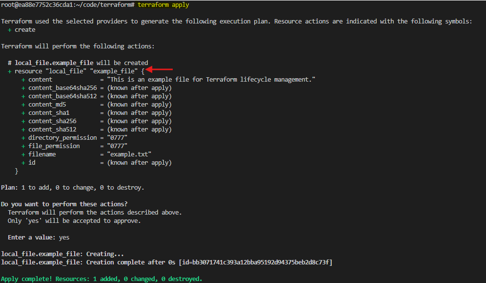

# Managing Resource Lifecycle in Terraform with Local Provider

In this lab, we will explore Terraform lifecycle rules using the `local` provider. Lifecycle rules provide control over the creation, update, and deletion of resources. By using these rules, you can manage local files and ensure they are handled according to specific requirements.

## Objectives

1. Understand Terraform lifecycle rules and their benefits.
2. Create a local file resource with lifecycle rules to manage its creation and deletion.
3. Use the `ignore_changes`, `create_before_destroy`, and `prevent_destroy` lifecycle arguments.
4. Apply the Terraform configuration and observe the effects of lifecycle rules.


## Step 1: Setting Up Terraform Configuration

### Create a Terraform Project Directory

```sh
mkdir terraform
cd terraform
```

### Define the Provider

Create a new directory for your Terraform project and navigate to it. Create a file named `main.tf` and start by defining the `local` provider.

```py
# main.tf

provider "local" {
  # No additional configuration needed
}
```

### Create a Local File Resource

Define a local file resource and include lifecycle rules to control its behavior:

```py
resource "local_file" "example_file" {
  filename = "example.txt"
  content  = "This is an example file for Terraform lifecycle management."

  lifecycle {
    create_before_destroy = true
    prevent_destroy       = true
    ignore_changes        = [
      content
    ]
  }
}
```

### Explanation of Lifecycle Rules

- **`create_before_destroy`**: Ensures that a new file is created before the old one is deleted when a change forces replacement. This minimizes downtime by keeping the old file intact until the new one is ready.

- **`prevent_destroy`**: Prevents the file from being deleted, even if a `terraform destroy` command is issued. This is useful for critical files that should not be accidentally removed.

- **`ignore_changes`**: Ignores changes to specified resource attributes. In this case, changes to the `content` attribute are ignored, allowing you to modify content without triggering file recreation.

## Step 2: Initializing and Applying Terraform

### Initialize Terraform

Initialize your Terraform workspace to set up the environment:

```sh
terraform init
```


### Apply the Configuration

Apply the Terraform configuration to create the local file:

```sh
terraform apply
```



Type `yes` when prompted to confirm the creation of resources.

## Step 3: Observing Lifecycle Rules

### Modify the Configuration

Modify the content of the local file in your `main.tf` file:

```py
resource "local_file" "example_file" {
  filename = "example.txt"
  content  = "This is the updated content for the example file."

  lifecycle {
    create_before_destroy = true
    prevent_destroy       = true
    ignore_changes        = [
      content
    ]
  }
}
```

### Apply the Changes

Apply the modified configuration:

```sh
terraform apply
```


Observe that the file is not recreated, as the `ignore_changes` lifecycle rule is in effect.

### Test Prevent Destroy

Attempt to destroy the resources:

```sh
terraform destroy
```

You will see an error message indicating that the file cannot be destroyed due to the `prevent_destroy` lifecycle rule.

## Conclusion

In this lab, you learned how to use Terraform lifecycle rules to manage local file resources. By leveraging `create_before_destroy`, `prevent_destroy`, and `ignore_changes`, you gain more control over your resources and reduce the risk of accidental disruptions. This lab demonstrates how lifecycle rules can enhance resource management and stability within Terraform-managed environments.