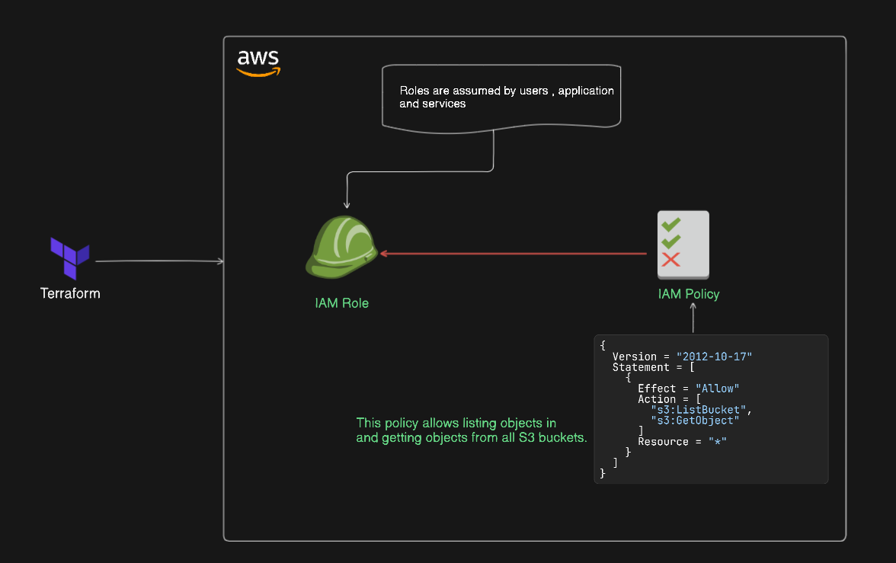
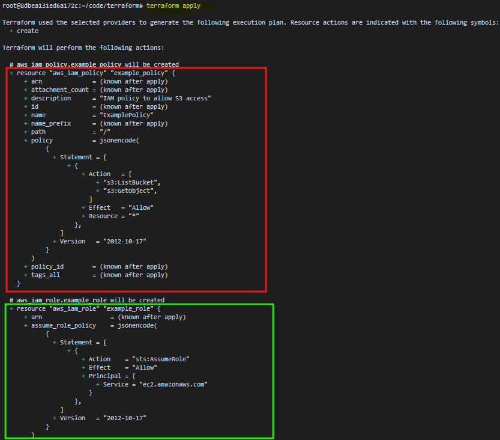

# Creating an IAM Role and Policy in AWS with Terraform

## Introduction

In this lab, we will learn how to create an IAM role and policy using Terraform. IAM (Identity and Access Management) is a crucial component of AWS that allows you to securely manage access to AWS services and resources. This lab will cover the concepts of IAM roles and policies and guide you through the process of creating them using Terraform.



## Objectives

1. Understand the concepts of IAM roles and policies.
2. Create an IAM policy using Terraform.
3. Create an IAM role using Terraform.
4. Attach the policy to the role.
5. Verify the setup.

## Prerequisites

- An AWS account with permissions to create IAM roles and policies.
- Terraform installed on your local machine.

## Understanding IAM Concepts

### IAM Policies

An **IAM policy** is a JSON document that defines permissions to allow or deny actions on AWS resources. Policies are attached to IAM identities (users, groups, and roles) to grant them specific permissions.

#### Key Components of an IAM Policy

- **Version**: The policy language version. Always use `"2012-10-17"`.
- **Statement**: A list of permissions in the policy.
  - **Effect**: Either `"Allow"` or `"Deny"` the action.
  - **Action**: The specific action(s) allowed or denied (e.g., `s3:GetObject`).
  - **Resource**: The AWS resources to which the actions apply.

### IAM Roles

An **IAM role** is an AWS identity with permission policies that determine what the identity can and cannot do in AWS. Unlike users, roles are not associated with a specific person or account. Instead, they are intended to be assumable by entities such as AWS services, applications, or users from another AWS account.

#### Key Features of IAM Roles

- **Assumable by Services**: Roles can be assumed by AWS services (e.g., EC2, Lambda) to perform actions on your behalf.
- **Temporary Credentials**: When a role is assumed, it provides temporary security credentials to access AWS resources.
- **Principal**: Defines who or what can assume the role (e.g., `ec2.amazonaws.com`).

## Lab Steps

### Step 1: Setting Up Terraform Configuration

#### Install AWS CLI

Before proceeding, ensure that the AWS CLI is installed on your local machine. Follow the instructions below based on your operating system:

- **Windows**:
  1. Download the AWS CLI MSI installer from the [official AWS website](https://aws.amazon.com/cli/).
  2. Run the downloaded MSI installer and follow the instructions.

- **Linux**:
  ```sh
  curl "https://awscli.amazonaws.com/awscli-exe-linux-x86_64.zip" -o "awscliv2.zip"
  unzip awscliv2.zip
  sudo ./aws/install
  ```

#### Configure AWS CLI

After installing the AWS CLI, configure it with the necessary credentials. Run the following command and follow the prompts to configure it:

```sh
aws configure
```

- **Explanation**: This command sets up your AWS CLI with the necessary credentials, region, and output format.


You will find the `AWS Access key` and `AWS Seceret Access key` on Lab description page,where you generated the credentials


#### Create a New Terraform Configuration File

### Create a Terraform Project Directory

```sh
mkdir terraform
cd terraform
```
Create a file named `main.tf` to define the IAM policy and role.

```py
# main.tf

provider "aws" {
  region = "ap-southeast-1"
}
```

- **Explanation**: This sets up the AWS provider and specifies the region (`ap-southeast-1`) where resources will be created.

### Step 2: Create an IAM Policy

#### Define the IAM Policy

Add a resource block to define an IAM policy that grants access to specific actions.

```py
resource "aws_iam_policy" "example_policy" {
  name        = "ExamplePolicy"
  description = "IAM policy to allow S3 access"

  policy = jsonencode({
    Version = "2012-10-17"
    Statement = [
      {
        Effect = "Allow"
        Action = [
          "s3:ListBucket",
          "s3:GetObject"
        ]
        Resource = "*"
      }
    ]
  })
}
```

- **Explanation**:
  - **`Effect`**: Set to `"Allow"` to permit the specified actions.
  - **`Action`**: Lists the S3 actions allowed by the policy.
  - **`Resource`**: Specifies the resources to which the actions apply. Here, `"*"` allows actions on all resources, but in a production environment, you should restrict this to specific resources.

### Step 3: Create an IAM Role

#### 3.1: Define the IAM Role

Add a resource block to define an IAM role that can assume the policy:

```py
resource "aws_iam_role" "example_role" {
  name = "ExampleRole"

  assume_role_policy = jsonencode({
    Version = "2012-10-17"
    Statement = [
      {
        Effect = "Allow"
        Principal = {
          Service = "ec2.amazonaws.com"
        }
        Action = "sts:AssumeRole"
      }
    ]
  })
}
```

- **Explanation**:
  - **`Principal`**: Defines who can assume the role. Here, the EC2 service (`"ec2.amazonaws.com"`) is specified.
  - **`Action`**: The action allowed for the principal, which is `"sts:AssumeRole"`.

### Step 4: Attach the Policy to the Role

#### 4.1: Attach the Policy

Add a resource block to attach the IAM policy to the role:

```py
resource "aws_iam_role_policy_attachment" "example_attachment" {
  role       = aws_iam_role.example_role.name
  policy_arn = aws_iam_policy.example_policy.arn
}
```

- **Explanation**:
  - **`role`**: References the IAM role defined earlier.
  - **`policy_arn`**: References the ARN of the IAM policy to be attached.

### Step 5: Initializing and Applying Terraform

#### 5.1: Initialize Terraform

Initialize your Terraform workspace to download the required provider plugins:

```sh
terraform init
```


#### 5.2: Apply the Configuration

Apply the Terraform configuration to create the IAM role and policy:

```sh
terraform apply
```



Type `yes` when prompted to confirm the creation of resources.

### Step 6: Verifying the Setup

#### 6.1: Verify in AWS Console

1. **IAM Policy**: Navigate to the IAM section in the AWS Console and verify that the policy `ExamplePolicy` is created with the specified permissions.

2. **IAM Role**: Verify that the role `ExampleRole` is created and the policy is attached.

- **Explanation**: Ensuring that both the IAM role and policy are correctly set up is crucial for the role to have the intended permissions.

## Conclusion

In this lab, you learned how to create an IAM policy and role using Terraform. You defined an IAM policy that allows S3 access, created an IAM role that can be assumed by EC2 instances, and attached the policy to the role. This exercise demonstrates the power of Terraform in managing AWS IAM resources, highlighting best practices for security and role-based access control.