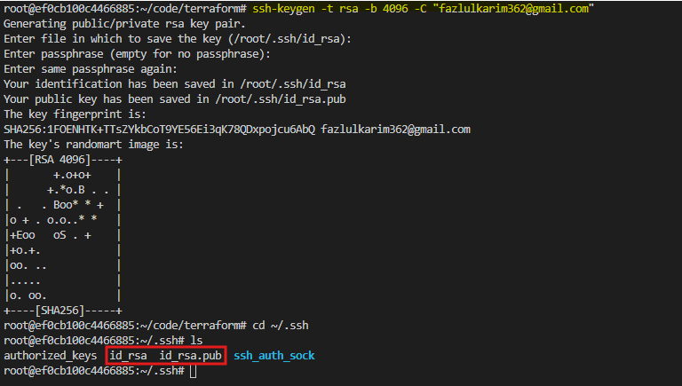
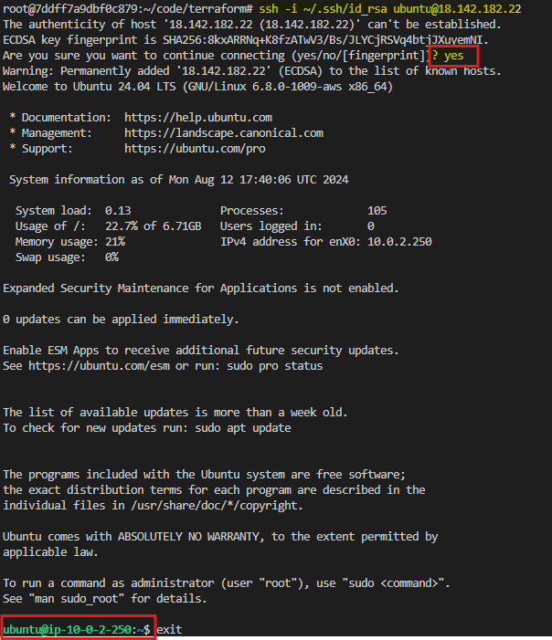
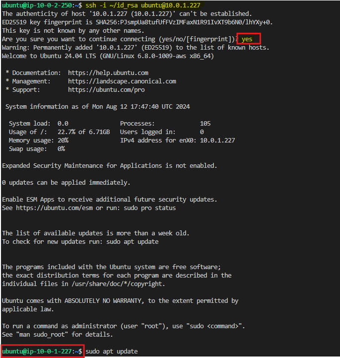

## Securing Private Subnet Access with a Bastion Server in a VPC with Terraform

In this lab, you will create a Virtual Private Cloud (VPC) with both public and private subnets. You will set up a NAT gateway for the private subnet, launch EC2 instances in both subnets, and then access the private EC2 instance by SSHing into the public instance first and using it as a jump host.


## Objectives

1. Create a VPC with public and private subnets.
2. Create and use an SSH key pair.
3. Launch an EC2 instance in the public subnet.
4. Launch an EC2 instance in the private subnet.
5. Set up a NAT Gateway and a private route table for the private subnet.
6. SSH into the private EC2 instance using the public EC2 instance as a jump host.

## What is a Bastion Server?

A bastion server is an EC2 instance that acts as a secure gateway for accessing private instances within an AWS VPC environment. Also known as a jump server, it provides a controlled access point from the internet into the private network.

A bastion server runs on an Ubuntu EC2 instance hosted in a public subnet of an AWS VPC. This instance is configured with a security group that allows SSH access from anywhere over the internet. The bastion server facilitates secure connections to instances within private subnets, ensuring that these instances remain inaccessible directly from the internet, thereby enhancing the overall security of the VPC.

## Step 1: Setting Up the VPC and Subnets

### Install AWS CLI

Before proceeding, ensure that the AWS CLI is installed on your local machine. Follow the instructions below based on your operating system:

- **Windows**:
  1. Download the AWS CLI MSI installer from the [official AWS website](https://aws.amazon.com/cli/).
  2. Run the downloaded MSI installer and follow the instructions.

- **Linux**:
  ```sh
  curl "https://awscli.amazonaws.com/awscli-exe-linux-x86_64.zip" -o "awscliv2.zip"
  unzip awscliv2.zip
  sudo ./aws/install
  ```

#### Configure AWS CLI

After installing the AWS CLI, configure it with the necessary credentials. Run the following command and follow the prompts to configure it:

```sh
aws configure
```

- **Explanation**: This command sets up your AWS CLI with the necessary credentials, region, and output format.


You will find the `AWS Access key` and `AWS Seceret Access key` on Lab description page,where you generated the credentials


### Create the Terraform Project Directory

Start by creating a directory for your Terraform project:

```sh
mkdir terraform
cd terraform
```

### Create the VPC and Subnets

Create a `main.tf` file to define your VPC, public and private subnets, internet gateway, and NAT gateway with Terraform registry modules:

```py
# main.tf

provider "aws" {
  region = "ap-southeast-1"
}

module "vpc" {
  source  = "terraform-aws-modules/vpc/aws"
  version = "4.0.0"  # Specify the version of the module

  name = "my-vpc"
  cidr = "10.0.0.0/16"

  azs             = ["ap-southeast-1a"]
  private_subnets = ["10.0.1.0/24"]
  public_subnets  = ["10.0.2.0/24"]

  enable_nat_gateway = true
  single_nat_gateway = true

  enable_dns_hostnames = true
  enable_dns_support   = true

  # Explicitly enable auto-assign public IPv4 address on public subnets
  map_public_ip_on_launch = true

  tags = {
    Terraform   = "true"
    Environment = "dev"
  }
}
```
### Explanation

- **`provider "aws"`**: Specifies the AWS provider and the region where resources will be created.
- **`module "vpc"`**: Uses the VPC module from the Terraform Registry to create a VPC along with public and private subnets, NAT gateways, and route tables.
- **`cidr`**: Specifies the CIDR block for the VPC.
- **`azs`**: Specifies the availability zones in which the subnets will be created.
- **`private_subnets` and `public_subnets`**: Define the CIDR blocks for the private and public subnets, respectively.
- **`enable_nat_gateway`**: Enables the creation of NAT gateways for private subnets.
- **`single_nat_gateway`**: Configures the module to create only one NAT gateway.

## Step 2: Creating Security Groups

### Define Security Groups for the Instances

Update `main.tf` to include security groups for the EC2 instances:

```py
# Security Group for the Public Instance
resource "aws_security_group" "public_sg" {
  vpc_id = aws_vpc.main.id

  ingress {
    from_port   = 22
    to_port     = 22
    protocol    = "tcp"
    cidr_blocks = ["0.0.0.0/0"]
  }

  egress {
    from_port   = 0
    to_port     = 0
    protocol    = "-1"
    cidr_blocks = ["0.0.0.0/0"]
  }

  tags = {
    Name = "public-sg"
  }
}

# Security Group for the Private Instance
resource "aws_security_group" "private_sg" {
  vpc_id = aws_vpc.main.id

  ingress {
    from_port   = 22
    to_port     = 22
    protocol    = "tcp"
    cidr_blocks = ["10.0.1.0/24"]  # Only allow SSH from the public subnet
  }

  egress {
    from_port   = 0
    to_port     = 0
    protocol    = "-1"
    cidr_blocks = ["0.0.0.0/0"]
  }

  tags = {
    Name = "private-sg"
  }
}
```

### Explanation

- **Public Security Group**: Allows SSH access from anywhere.
- **Private Security Group**: Allows SSH access only from the public subnet (restricted by CIDR).

## Step 3: Creating Key Pair and Launching EC2 Instances

### Create a Key Pair

Add the following to `main.tf` to create a new SSH key pair:

```py
# Key Pair
resource "aws_key_pair" "main" {
  key_name   = "main-key"
  public_key = file("~/.ssh/id_rsa.pub")  # Replace with your own public key
}
```

### Define the EC2 Instances

Update `main.tf` to add the EC2 instances:

```py
# Public EC2 Instance
resource "aws_instance" "public" {
  ami           = "ami-060e277c0d4cce553"  # Ubuntu AMI
  instance_type = "t2.micro"
  subnet_id     = aws_subnet.public.id
  key_name      = aws_key_pair.main.key_name

  tags = {
    Name = "public-instance"
  }

  security_groups = [aws_security_group.public_sg.name]
}

# Private EC2 Instance
resource "aws_instance" "private" {
  ami           = "ami-060e277c0d4cce553"  # Ubuntu AMI
  instance_type = "t2.micro"
  subnet_id     = aws_subnet.private.id
  key_name      = aws_key_pair.main.key_name

  tags = {
    Name = "private-instance"
  }

  security_groups = [aws_security_group.private_sg.name]
}
```

### Explanation

- **Key Pair**: A new SSH key pair is created and used for both instances.
- **Public Instance**: An EC2 instance in the public subnet with SSH access allowed from anywhere.
- **Private Instance**: An EC2 instance in the private subnet with SSH access only from the public subnet.

## Step 4: Generate SSH Keys:
   - If you haven’t already, generate a new SSH key pair on your local machine:

   ```sh
   ssh-keygen -t rsa -b 4096 -C "your_email@example.com"
   ```

   This generates a private key (`id_rsa`) and a public key (`id_rsa.pub`) in the `~/.ssh/` directory.

   Verify the key are generated 

   ```sh
   cd ~/.ssh
   ls 
   ```

   

## Step 5: Applying the Configuration

### Initialize Terraform

Initialize Terraform to download the necessary providers and set up your environment:

```sh
terraform init
```


### Apply the Configuration

Apply the Terraform configuration to create the resources:

```sh
terraform apply
```

Type `yes` when prompted to confirm the creation of resources.

### Verifying the Infrastructure

#### Verify the Resource Map

In the VPC Dashboard in AWS Console, click on `my-vpc` we just created,here you will find resource map


#### Verify the EC2 instances are running 

In `EC2` Dashboard in AWS Console ,click on running instances ,you will find the instances we created 


## Step 5: SSH into the Private EC2 Instance via the Public EC2 Instance

### SSH into the Public Instance

Use your SSH key to connect to the public instance:

```sh
ssh -i ~/.ssh/id_rsa ubuntu@<public-instance-ip>
```



Replace `<public-instance-ip>` with the public IP address of your public EC2 instance

### Copy the SSH Key to the Public Instance
`Exit` from the `public ec2 instance` then, copy the SSH private key to the `public instance`:

```sh
scp -i ~/.ssh/id_rsa ~/.ssh/id_rsa ubuntu@<public-instance-ip>:~/
```


### SSH into the Private Instance from the Public Instance

SSH into the public ec2 instance by running:

```sh
ssh -i ~/.ssh/id_rsa ubuntu@<public-instance-ip>
```

From public ec2 instance ssh into private ec2 instance

```sh
ssh -i ~/id_rsa ubuntu@<private-instance-ip>
```



Replace `<private-instance-ip>` with the private IP address of your private EC2 instance, which you can find in the AWS Management Console or Terraform output.


### Explanation

- **Public EC2**: Acts as a jump host that you SSH into first.
- **Private EC2**: Accessed through the SSH session on the public EC2, effectively securing it from direct public access.

## Conclusion

In this lab, you created a VPC with both public and private subnets, set up a NAT gateway for the private subnet, and launched EC2 instances in each subnet. You configured security groups to allow controlled SSH access and used the public instance as a jump host to securely SSH into the private instance. This setup is a common practice in secure environments where direct access to private instances is restricted for security reasons.