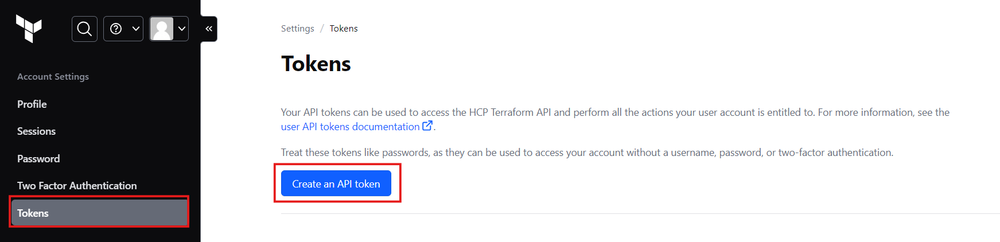
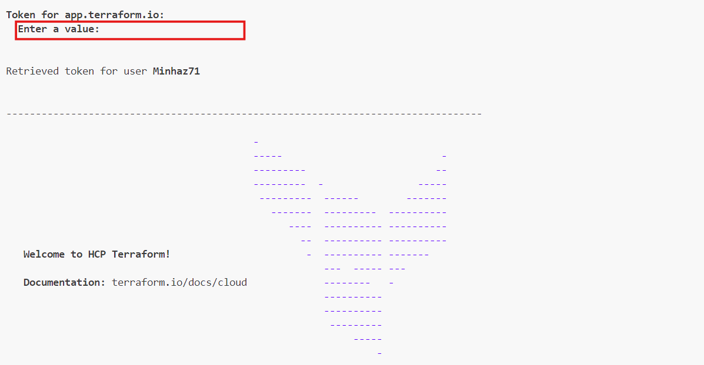
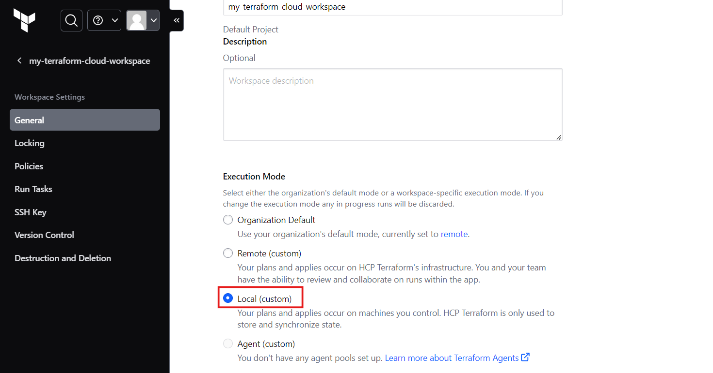
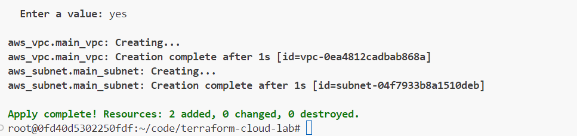
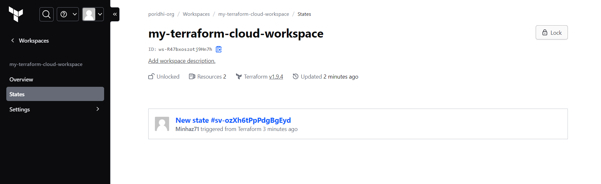

# Understanding Remote State and Remote Backends with Terraform Cloud

In Terraform, the state file is crucial as it maps Terraform configurations to real-world infrastructure. By default, this state file is stored locally in the `terraform.tfstate` file. While local state storage is convenient for individual projects, it doesn't scale well for team collaboration due to issues like state file corruption, lack of state locking, and the risk of exposing sensitive information. To address these challenges, Terraform allows you to store state remotely using remote backends, like S3 or Terraform Cloud, which offer secure, shared storage and state locking.

In this lab, we'll explore how to configure and use Terraform Cloud as a remote backend for your Terraform state file. You'll learn how to securely manage your infrastructure state, enabling collaboration while protecting sensitive data.


## **Prerequisites**

Before starting this lab, ensure you have the following:

1. **AWS Configuration**: Use `aws configure` command to configure AWS.
2. **Terraform Cloud Account**: Set up a free Terraform Cloud account.
3. **Create organization and workspace**: In terraform cloud account create an organization and workspace if you don't have any.

## **Task**

You are part of a DevOps team tasked with managing the infrastructure for a new application. The application requires a VPC with a subnet. You need to configure Terraform Cloud as the remote backend for managing this infrastructure. The state file should be stored securely, with the ability to lock the state during updates to avoid conflicts. The configuration should be managed in a way that allows other team members to collaborate without risking state file corruption or exposing sensitive information.


## **Solution and Steps**

### **Step 1: Log in to Terraform Cloud**

1. **Generate a Terraform Cloud Token:**
   - Go to your Terraform Cloud account and generate an API token.
   - Copy the token to use in the next step.

   

2. **Log in to Terraform Cloud:**
   ```bash
   terraform login
   ```
   - Paste the API token when prompted.

   

### **Step 2: Initialize a New Terraform Configuration**

1. **Create a Directory for Your Project:**
   ```bash
   mkdir terraform-cloud-lab
   cd terraform-cloud-lab
   ```

2. **Create the Terraform Configuration Files:**

    - `main.tf` (AWS provider and resource definitions):
        ```hcl
        provider "aws" {
            region = "ap-southeast-1"
        }

        resource "aws_vpc" "main_vpc" {
            cidr_block = "10.0.0.0/16"
        }

        resource "aws_subnet" "main_subnet" {
            vpc_id     = aws_vpc.main_vpc.id
            cidr_block = "10.0.1.0/24"
        }
        ```

   - `terraform.tf` (Terraform Cloud backend configuration):
    
        ```hcl
        terraform {
            backend "remote" {
                organization = "poridhi-org"       # Use your organization name

                workspaces {
                    name = "my-terraform-cloud-workspace"  # use your workspace name
                }
            }
        }
        ```

### **Step 3: Initialize the Terraform Project**

1. **Initialize the Terraform Project:**
   ```bash
   terraform init
   ```
   This will configure Terraform to use the remote backend with Terraform Cloud.


### **Step 4: Set the execution mode**

1. **Go to terraform cloud:**
    - Navigate to your workspace.
    - Go to **workspce settings** > **general**.
    - Set the execution mode to **Local** and save it.

    


### **Step 5: Plan and Apply the Configuration**

1. **Run Terraform Plan:**
   ```bash
   terraform plan
   ```
   Review the execution plan to ensure everything is set up correctly.

2. **Run Terraform Apply:**
   ```bash
   terraform apply
   ```
   Confirm the apply to create the infrastructure.

    

### **Step 6: Verify Remote State Storage**

**Log in to Terraform Cloud:**
- Navigate to your workspace and verify that the state file is stored remotely.

    


## Conclusion

In this lab, you have successfully set up Terraform Cloud as a remote backend for managing the state of your Terraform project. By storing the state file in Terraform Cloud, you've ensured that the infrastructure is managed securely and efficiently, with features like state locking and team collaboration capabilities. This setup allows you to manage infrastructure in a more scalable and secure manner, making it ideal for production environments and team projects.
