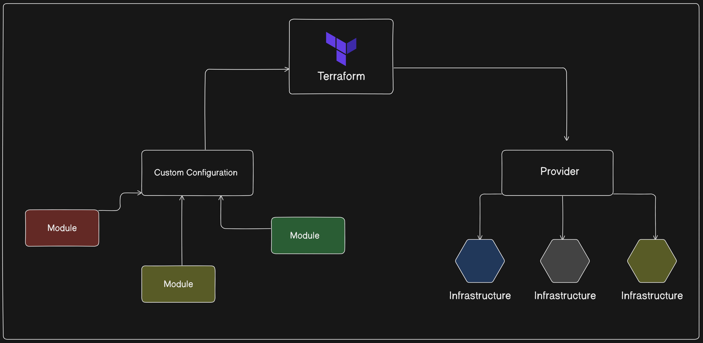
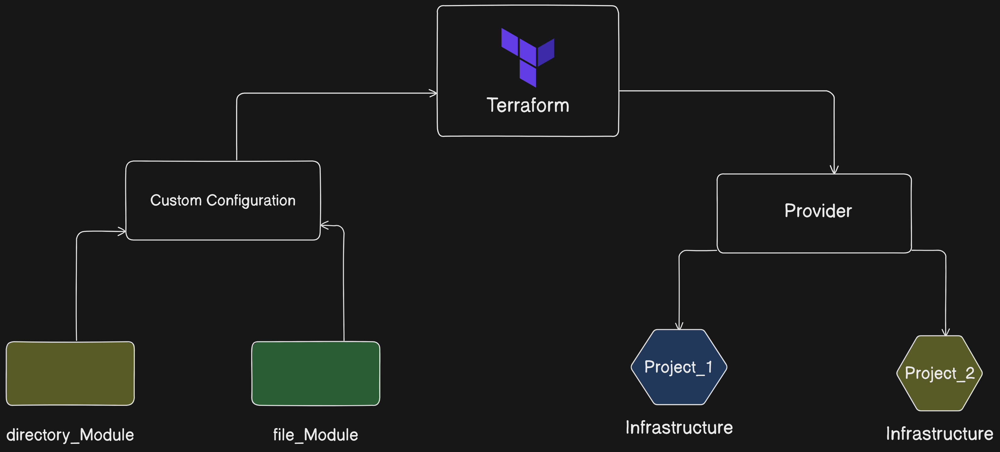

# Terraform Modules with the Local Provider

In this lab, you will learn how to use Terraform modules with the local provider to manage files and directories on your local filesystem. 

## What are Terraform Modules?

**Terraform module :** Modules are groups of `.tf` files that are kept in a different directory from the configuration as a whole. A module’s scope encompasses all of its resources. So, if the user needs information about the resources that a module creates, the module must be explicitly stated. To do this, declare an output on the module that exposes the necessary data and permits references to that output from outside the module



### Advantages of Using Terraform Modules

1. **Reusability**: Modules allow you to define your infrastructure once and reuse it across multiple environments or projects, reducing duplication.
2. **Maintainability**: By grouping related resources into a module, you can manage and update infrastructure more easily and consistently.
3. **Collaboration**: Modules can be shared among teams, promoting consistency and best practices across your organization.

## Scenario Description

You are tasked with setting up and managing a directory structure and files on your local filesystem. Instead of writing all the configurations in a single Terraform configuration file, you decide to use modules to organize your code. This will help you create a reusable setup that can be applied to different projects with minimal changes.




## Objectives

1. Create a Terraform module that manages directory creation.
2. Create a Terraform module that manages file creation within those directories.
3. Use these modules to set up a directory structure with files in your local environment.
4. Apply the Terraform configuration to create the directories and files.

## Step 1: Setting Up the Project Structure

### Directory Structure

Organize your Terraform project with the following directory structure:

```
terraform-local-modules/
├── modules/
│   ├── directory/
│   └── file/
└── environments/
    ├── project1/
    └── project2/
```

- **`modules/directory/`**: Contains the module for creating directories.
- **`modules/file/`**: Contains the module for creating files.
- **`environments/project1/`** and **`environments/project2/`**: Contains the environment-specific configurations for different projects.

## Step 2: Create the Directory Module

### Define the Directory Module

Navigate to the `modules/directory/` directory and create the Terraform configuration to manage directories:

**`modules/directory/main.tf`:**

```py
resource "null_resource" "create_dir" {
  provisioner "local-exec" {
    command = "mkdir -p ${var.directory_path}"
  }
}
```

**`modules/directory/variables.tf`:**

```py
variable "directory_path" {
  description = "The path of the directory to be created"
  type        = string
}
```
**`modules/directory/outputs.tf`:**

```py
output "directory_path" {
  value = var.directory_path
}
```

**Explanation:**

- This module creates a directory at the specified path using a `null_resource` with a local-exec provisioner to execute the `mkdir` command.

## Step 3: Create the File Module

### Define the File Module

Navigate to the `modules/file/` directory and create the Terraform configuration to manage files:

**`modules/file/main.tf`:**

```py
resource "local_file" "file" {
  filename = var.file_path
  content  = var.file_content
}
```

**`modules/file/variables.tf`:**

```py
variable "file_path" {
  description = "The path of the file to be created"
  type        = string
}

variable "file_content" {
  description = "The content of the file"
  type        = string
}
```

**Explanation:**

- This module creates a file at the specified path with the specified content using the `local_file` resource.

## Step 4: Use the Modules in the Environments

### Define the Configuration for `project1`

Navigate to the `environments/project1/` directory and create a Terraform configuration that uses the modules:

**`environments/project1/main.tf`:**

```py
provider "local" {}

module "project1_dir" {
  source         = "../../modules/directory"
  directory_path = "${path.module}/project1_dir"
}

module "project1_file" {
  source        = "../../modules/file"
  file_path     = "${module.project1_dir.directory_path}/file.txt"
  file_content  = "This is Project 1."
}
```

### Define the Configuration for `project2`

Navigate to the `environments/project2/` directory and create a similar Terraform configuration:

**`environments/project2/main.tf`:**

```py
provider "local" {}

module "project2_dir" {
  source         = "../../modules/directory"
  directory_path = "${path.module}/project2_dir"
}

module "project2_file" {
  source        = "../../modules/file"
  file_path     = "${module.project2_dir.directory_path}/file.txt"
  file_content  = "This is Project 2."
}
```

**Explanation:**

- The configurations for both `project1` and `project2` create separate directories and files using the same modules.
- The directory and file paths are constructed dynamically using the `path.module` variable, which points to the current module's directory.

## Step 5: Initialize and Apply the Terraform Configuration

### Initialize Terraform

Navigate to project1 directory and initialize Terraform:

```sh
cd terraform-local-modules/environments/project1
terraform init
```

### Apply the Configuration

Apply the Terraform configuration in each environment to create the directories and files:

```sh
terraform apply
```

Type `yes` when prompted to confirm the creation of resources.

### Initialize Terraform

Navigate to project2 directory and initialize Terraform:

```sh
cd ../project2
terraform init
```

### Apply the Configuration

Apply the Terraform configuration in each environment to create the directories and files:

```sh
terraform apply
```

Type `yes` when prompted to confirm the creation of resources.

### Verify the Results

Check your local filesystem to ensure that the directories and files have been created correctly in both `project1` and `project2`.


## Conclusion

In this lab, you learned how to use Terraform modules with the local provider to manage directories and files on your local filesystem. By organizing your Terraform code into reusable modules, you made your configuration more maintainable and adaptable to different projects. This approach can be extended to more complex local resource management or even cloud-based resources by switching providers.

